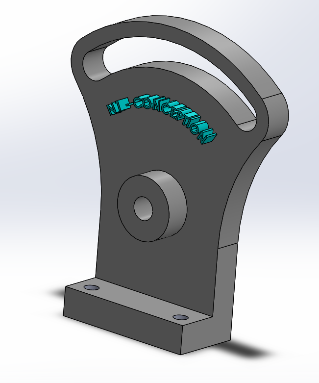

# Part-drawing-15-SW
This repositary contains a solidworks part file for a mechanical component designed as part of my project work for learning purpose. It is fully defined.
## File Included
- 'project15_nishchay.  SLDPRT' -
solidworks part file
## License
this project is licensed under the MIT license.

