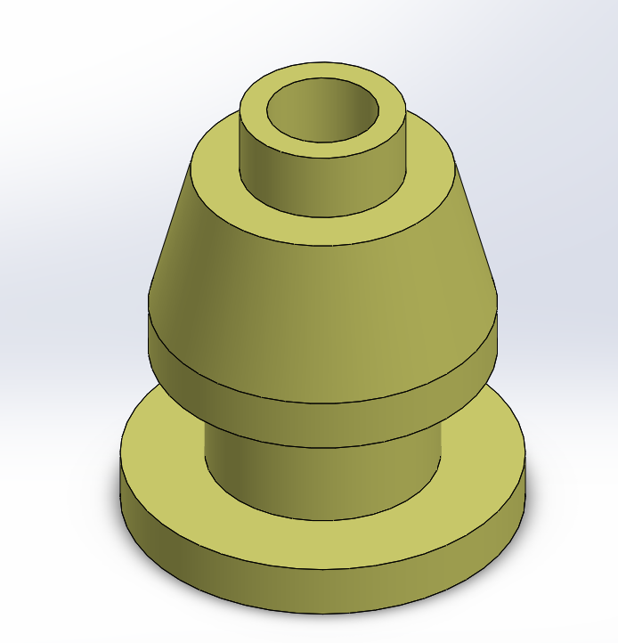
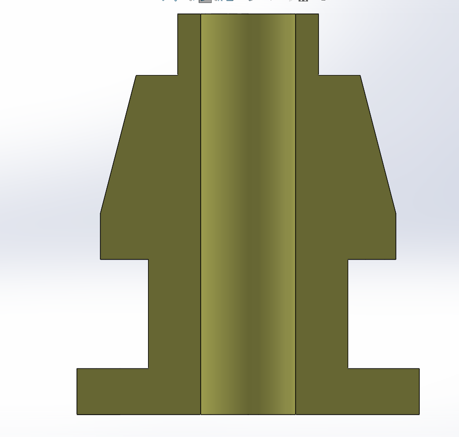

# Part-drawing-19-SW
This repositary contains a solidworks part file for a mechanical component designed as part of my project work for learning purpose. 

The Design is fully Defined.

## File Included
- 'project19_nishchay.  SLDPRT' -
solidworks part file
## License
this project is licensed under the MIT license.

### Isometric View

### Section View

Thanks for Viewing!

