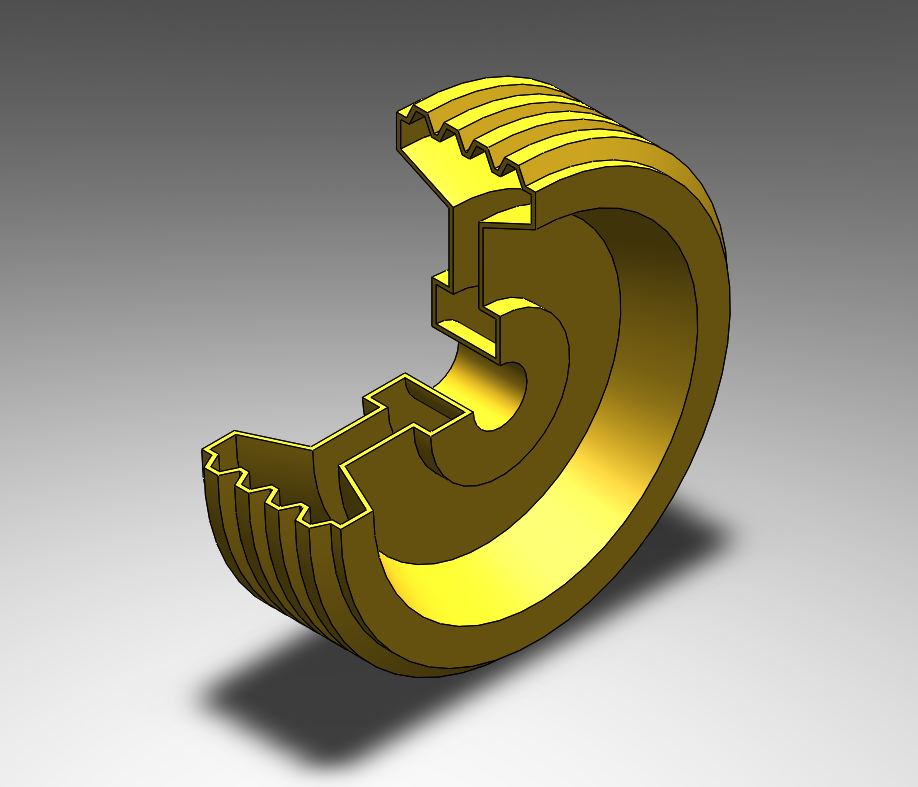

# Part-drawing-2-SW
This repositary contains a solidworks part file for a mechanical component designed as part of my project work. The material used is copper alloy- Brass.
## File Included
- 'project2_nishchay.  SLDPRT' -
solidworks part file
## License
this project is licensed under the MIT license.

